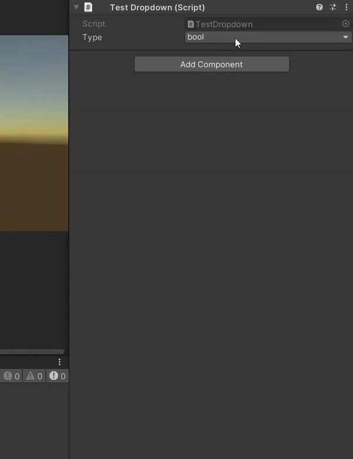

# Unity Dropdown
A better-looking dropdown window for Unity Editor that can easily replace GenericMenu in your editor tools.

[](https://openupm.com/packages/com.solidalloy.unity-dropdown/)

Unity Dropdown is a replacement for GenericMenu with a similar functionality but better visuals and more features like search bar.


## Installation

:heavy_exclamation_mark: Before installing the package, please disable the **Assembly Version Validation** option in **Player Settings**.

### Install with OpenUPM

Once you have the [OpenUPM cli](https://github.com/openupm/openupm-cli#installation), run the following command:

```openupm install com.solidalloy.unity-dropdown```

Or if you don't have it, add the scoped registry to manifest.json with the desired dependency semantic version: 

```json
  "scopedRegistries": [
    {
      "name": "package.openupm.com",
      "url": "https://package.openupm.com",
      "scopes": [
        "com.solidalloy",
        "com.openupm",
        "org.nuget"
      ]
    }
  ],
  "dependencies": {
    "com.solidalloy.unity-dropdown": "1.1.1"
  },

```

### Install via Package Manager

Project supports Unity Package Manager. To install the project as a Git package do the following:

1. In Unity, open **Project Settings** -> **Package Manager**.
2. Add a new scoped registry with the following details:
   - **Name**: package.openupm.com
   - **URL**: https://package.openupm.com
   - Scope(s):
     - com.openupm
     - com.solidalloy
     - org.nuget
3. Hit **Apply**.
4. Go to **Window** -> **Package Manager**.
5. Press the **+** button, *Add package from git URL*.
6. Enter **com.solidalloy.unity-dropdown**, press **Add**.

## Example of Usage

```csharp
private void ShowWarriorDropdown(Type currentValue)
{
    var dropdownItems = new List<DropdownItem<Type>>();

    dropdownItems.Add(new DropdownItem<Type>(typeof(Archer), "Ranged/Archer", selected: true));
    dropdownItems.Add(new DropdownItem<Type>(typeof(Crossbowman), "Ranged/Crossbowman"));
    dropdownItems.Add(new DropdownItem<Type>(typeof(Knight), "Melee/Knight"));
    dropdownItems.Add(new DropdownItem<Type>(typeof(Lancer), "Melee/Lancer"));
    dropdownItems.Add(new DropdownItem<Type>(typeof(Cavalryman), "Melee/Cavalryman"));
    
    dropdownItems.Find(item => item.Value == currentValue).IsSelected = true;

    var dropdownMenu = new DropdownMenu<Type>(dropdownItems, currentValue, selectedType => (Warrior)Activator.CreateInstance(selectedType));
    
    dropdownMenu.ShowAsContext();
}

private void DrawWarriorField(Rect position, Type currentType)
{
    if (EditorGUI.DropdownButton(position, currentType.Name, FocusType.Keyboard))
    {
        var warrior = ChooseWarrior(currentType);
    }
}
```

To create a menu, you first need to create a collection of dropdown items. The minimum information you must provide to each item is its path and value, which can be of any type. The collection can be a list or array, it doesn't matter. Then, a dropdown menu is created by passing the collection of items to its constructor, the current value that should be selected when the dropdown is open, and an action indicating what is done to the newly selected value (e.g. assignment to a serialized property).

You can replace your `GenericMenu` with a **DropdownMenu** everywhere. For example, you can use it with `EditorGUI.DropdownButton()`. The dropdown window will look like this:


## More Info

### DropdownItem

Once the number of items pass a certain threshold (10 items by default), a search bar will show up where users can filter items by their names:


As you can see on the previous image, the items in search appeared by their full paths. If you want to change this behavior, pass a parameter called **searchName** to `DropdownItem`:

```csharp
dropdownItems.Add(new DropdownItem<Type>(typeof(Archer), "Ranged/Archer", searchName: "Archer"));
```


You can also put icons for the items:

```csharp
var transform = go.GetComponent<Transform>();
var collider = go.GetComponent<Collider>();

var dropdownItems = new DropdownItem<Component>[]
{
    new DropdownItem<Component>(transform, "Transform", icon: EditorGUIUtility.ObjectContent(transform, typeof(Transform)).image),
    new DropdownItem<Component>(collider, "Collider", icon: EditorGUIUtility.ObjectContent(collider, typeof(Collider)).image)
};
```


To mark an item as selected, pass `selected = true` to the item's constructor:

```csharp
new DropdownItem<string>("Archer", "Ranged/Archer", isSelected: true);
```

You can also mark an item as selected after gathering all the needed items:

```csharp
var itemToSelect = dropdownItems.Find(item => item.Value == currentValue);

if (itemToSelect != null)
    itemToSelect.IsSelected = true;
```

However, make sure to do it before passing the items to the `DropdownMenu` constructor. When `DropdownMenu` is created, it builds a node tree from the items, so it's necessary to find a node to mark it as selected:

```csharp
var dropdownMenu = new DropdownMenu(dropdownItems, selectedItem => OnItemSelected(selectedItem));
dropdownMenu.ShowAsContext();

dropdownItems[2].IsSelected = true; // This will be of no effect

// But this will work
dropdownMenu.SelectedNode = dropdownMenu.EnumerateNodes().FirstOrDefault(node => node.Value == someValue);
```

### DropdownMenu constructor optional arguments

- ***searchbarMinItemsCount*** (10 by default) - the minimum number of items at which to show the search bar. If you want to see a search bar every time, even if there are only two items in the menu, set it to 0.
- ***sortItems*** (false by default) - whether to sort items alphabetically. It sorts items very efficiently, so if you have a large number of items, this option will be better rather than sorting the items by yourself before passing them to DropdownMenu.
- ***showNoneElement*** (false by default) - whether to show the "**None**" option in the dropdown menu. This option's value always equals to null for reference types, or to the default instance of a struct. It may be useful when the field is not always supposed to be filled with some value and is allowed to be null. It behaves a little bit differently from regular items: when the list is scrolled, it always stays on top, and it's always hidden when the user searches for an item.



### More functionality with DropdownMenu

Unlike GenericMenu, DropdownMenu exposes a lot of properties and methods so that you can expand certain folders, select nodes, delete items dynamically.

`ExpandAllFolders()` expands all the folder in a dropdown. By default, only the folder where the item is selected is expanded. But you may want the user to see all the items in folders at a glance.

```csharp
var dropdownMenu = new DropdownMenu(dropdownItems, selectedItem => OnItemSelected(selectedItem));
dropdownMenu.ExpandAllFolders();
dropdownMenu.ShowAsContext();
```

`DropdownMenu` builds a node tree containing of folders and items or other folders in them. Enumerate these nodes with the `EnumerateNodes()` method. Search for the folder or an item you are interested in and operate on it:

```csharp
var meleeFolder = dropdownMenu.EnumerateNodes().FirstOrDefault(node => node.Name == "Melee");
meleeFolder.Expanded = true;
meleeFolder.ChildNodes.RemoveAt(1);
```

### DropdownWindow

`dropdownMenu.ShowAsContext()` actually returns an instance of `DropdownWindow` that exposes all properties of `EditorWindow`. So, you can check its position, or `Close()` it before the user makes a choice:

```csharp
var dropdownWindow = dropdownMenu.ShowAsContext();
Debug.Log($"position: {dropdownWindow.position}, has focus: {dropdownWindow.hasFocus}");
dropdownWindow.Close();
```

In addition to `ShowAsContext()`, DropdownMenu has the `ShowDropdown()` method that takes a `Vector2` in to show the dropdown at a given posiiton. The position represents the left top corner of the dropdown. 

DropdownMenu calculates the window width itself based on the length of the longest item in the list, but you can supply it with a custom height. The min height is 100 pixels, and the max is 600 px. If you provide a number out of the range, it will be clamped.

```csharp
dropdownMenu.ShowAsDropdown(new Vector2(100, 300));
dropdownMenu.ShowAsContext(windowHeight: 300);
dropdownMenu.ShowDropdown(dropdownMenu.GetCenteredPosition()); // There's a method that will center a window properly based on its height and width.
```
